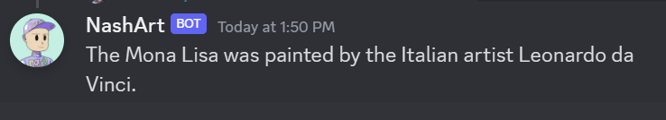

# NashArt

A discord bot that acts as an art assistant
chatbot using GPT-3.5. Can answer all kinds of art-related questions and is online 24/7 using replit and a runtime robot. We used discord-interactions to give users some privacy so when they are asking questions, the questions are not immediately visible unless you click on the interaction.

## Setup

1. On Windows git clone repo
2. cd into NashArt
3. activate Environment using

```
 .\env\bin\Activate.ps1
```

- For Execution Policy Warning run Powershell as Administrator
- **OR** run

```
Set-ExecutionPolicy -ExecutionPolicy RemoteSigned -Scope
```

4. run

```
py -m pip install -r requirements.txt
```

5. Create an .env file to store your Discord Token

```
# environment variables defined inside a .env file
DISCORD_TOKEN="DISCORD TOKEN"
```

6. run

```
py bot.py
```

## Discord Commands

Commands

```
/tts-ask 'prompt'
/ask 'prompt'
```

Example

```
/ask who painted the Mona Lisa?


```
